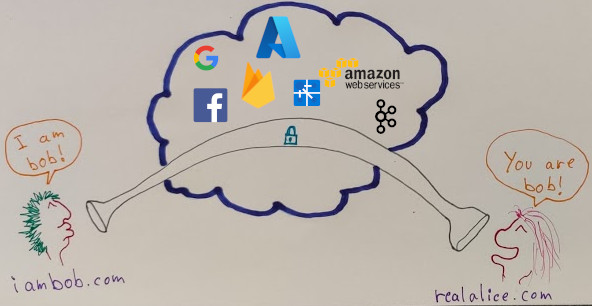
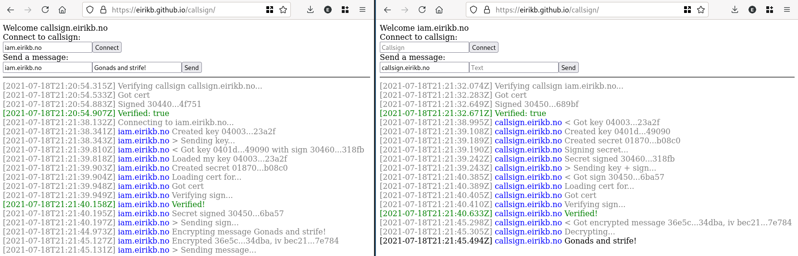

# Callsign

Proof of concept End-to-end encryption (E2EE).  
Using **domain** as shared data.

* Create a domain, this will be your **callsign** for years to come
* Create a (Let's Encrypt) certificate
* Host this certificate on said domain

Pattern:  
**`https://<callsign>/<callsign>.crt`**

That's it.  
Share this domain with others, and they can use this to securely send you messages.  
No physical verification required.  
No manual verification required.

---

All participants must have a domain.  
This solution can only be as secure as your domain and your certificate.  
You must trust:

* Your domain provider
* Your TLS provider

## Demo

**https://eirikb.github.io/callsign/**

* Working demo
* You need two sites with callsign
    * HTTPS enabled, certificate located at `https://<callsign>/<callsign>.crt`.
    * Private key of each certificate at hand. If you use the [example-callsign](example-callsign) setup you can find
      the key under `cert` folder (see [docker-compose.yml](example-callsign/docker-compose.yml))
* Using [Firebase](https://firebase.google.com) as communication channel.  
  This could be anything from Azure Web PubSub to Kafka, doesn't matter, they _can't snoop_.

## Pros

* Domains are easy-ish to remember, can in many cases be shared verbally
* The domain is permanent, while a public key will change
* Works in a browser
* No-code setup. The [demo callsign server](example-callsign) uses [caddy server](https://caddyserver.com), that's it
* Verification is fully automatic
* Automatic verification also means no need to re-check any manual verification (such as emoji or QR code)

## FAQ

> What makes this different from simply hosting a public GPG key?

Not much. For one in the demo I use the TLS certificate for verification.  
This certificate will be CA-verified simply by requesting it (thanks browser).  
It's also forced to refresh on a given interval.  
Losing the key to the public might become a bit more serious.

If that "simple hosting" was hosted by someone else there would be a greater difference, since you then would also have
to trust them.

> What if the domain isn't known, say in a general chat room?

In the case of unknown domain MITM can still work. A middleman can replace the whole domain simply by having a set of
their own domains.

> How safe would the DNS lookup be?

Uh, good question, if you want the lookup to be secure you would
need [DNSSEC](https://en.wikipedia.org/wiki/Domain_Name_System_Security_Extensions).  
To be honest today you would probably send the domain in plain sight for anyone in the middle to pick up.  
They would only be able to see who you chat with, but that can be almost as sad.

This solution should work fine with [TOR](https://en.wikipedia.org/wiki/Tor_(network)) though.

> My mom doesn't have a domain

If she trusts you, perhaps you can set up a subdomain for her?  
Subdomains should work just as well.

> If subdomains work, can I set up my own global and public "callsign" provider?

You can, but I don't trust you.

> You mentioned TOR, wouldn't this work very well with personal .onion-sites?

Yes, yes it would.

## How it works

Please see [e2ee.ts](example-client/src/e2ee.ts) code for implementation reference.

## Background

Intrigued by E2EE I did a deeper dive into how stuff work in the background in different apps.

I wondered how apps like WhatsApp, Signal and Telegram (providers) could possibly create a secure channel, through their
own servers, without being able to do [MITM](https://en.wikipedia.org/wiki/Man-in-the-middle_attack) attacks on their
own users.  
I'm far from being a security expert, but I found this very interesting.  
I've found out that this is immensely difficult. What larger providers tend to do is use physical verification, in form
of emojis or QR code. People must meet in real life and physically exchange information.  
Video call could possibly be hacked with deep fakes.

This repo is a demo of an alternative solution.  
It is not anything new, it is just a version of similar solutions implemented in a neat package.

## How it came to be

Playing around with Microsoft Azure Web PubSub I wondered if I could send messages through their PubSub service
securely, without Microsoft snooping in.  
Looking at existing E2EE I looked at Key Exchange with Diffie-Hellman, but it became clear it was vulnerable against
MITM attacks.  
Discussing multiple solutions with other individuals lead me to decide shared public GPG keys would do fine.  
However, how to share them, and how to keep them up-to-date.  
Then I wondered if I could utilize Let's Encrypt certificates. They are great because:

* Signed by a CA
* Forced to refresh
* Lots of built-in support

So it came to be; why not simply host a Let's Encrypt certificate and sign a key from key exchange with the Let's
Encrypt key. Then users could verify the key using the certificate.

